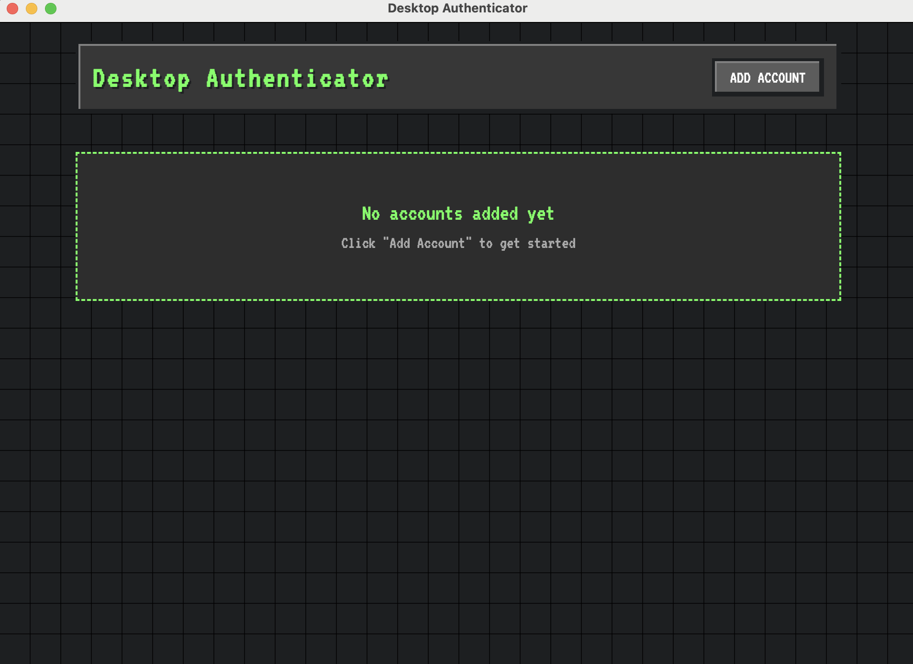

# Desktop Authenticator

A Minecraft-themed desktop authenticator app for macOS, built with Electron. This application provides a secure and stylish way to manage your two-factor authentication (2FA) codes with a unique Minecraft-inspired interface.



## Features

- 🎮 Minecraft-inspired UI with pixelated fonts and block-style elements
- 🔐 Secure TOTP (Time-based One-Time Password) generation
- 📱 Multiple QR code input methods:
  - File upload
  - Drag & drop
  - Clipboard paste (⌘V)
  - Screenshot support
- 🌙 Dark mode support
- 💾 Local encrypted storage using SQLite
- 🖥️ Native macOS integration

## Installation

### Prerequisites

- macOS 10.12 or later
- [Node.js](https://nodejs.org/) 14.0.0 or later
- [npm](https://www.npmjs.com/) (usually comes with Node.js)

### For Users

1. Download the latest release from the [Releases](https://github.com/yourusername/desktop-authenticator/releases) page
2. Choose either:
   - `.dmg` installer: Double-click and drag the app to your Applications folder
   - `.zip` archive: Extract and move the app to your Applications folder
3. When first opening the app, right-click (or Control-click) and select "Open" to bypass macOS security

### For Developers

1. Clone the repository:
```bash
git clone https://github.com/yourusername/desktop-authenticator.git
cd desktop-authenticator
```

2. Install dependencies:
```bash
npm install
```

3. Run in development mode:
```bash
npm start
```

4. Build the application:
```bash
npm run dist
```

The built application will be available in the `dist` directory.

## Usage

1. Launch the Desktop Authenticator app
2. Click "Add Account" to add a new 2FA account
3. Add accounts using one of these methods:
   - Scan a QR code (drag & drop or paste from clipboard)
   - Manually enter the secret key
4. Your 2FA codes will automatically update every 30 seconds

## Security Features

- Local data encryption using electron-store
- Secure secret key storage in SQLite database
- No cloud sync or external data transmission
- Memory-safe implementation with better-sqlite3

## Development

### Project Structure

```
desktop-authenticator/
├── main.js           # Main Electron process
├── renderer.js       # Renderer process
├── index.html        # Main application window
├── package.json      # Project configuration
└── README.md         # This file
```

### Technologies Used

- [Electron](https://www.electronjs.org/) - Cross-platform desktop framework
- [better-sqlite3](https://github.com/JoshuaWise/better-sqlite3) - SQLite database
- [otplib](https://github.com/yeojz/otplib) - TOTP generation
- [electron-store](https://github.com/sindresorhus/electron-store) - Encrypted storage
- [jimp](https://github.com/oliver-moran/jimp) - Image processing
- [qrcode-reader](https://github.com/edi9999/jsqrcode) - QR code scanning

### Building

To build for different platforms:

```bash
# Build for macOS
npm run dist

# Build specific format
npm run dist -- --mac --dmg  # DMG only
npm run dist -- --mac --zip  # ZIP only
```

## Contributing

1. Fork the repository
2. Create your feature branch (`git checkout -b feature/AmazingFeature`)
3. Commit your changes (`git commit -m 'Add some AmazingFeature'`)
4. Push to the branch (`git push origin feature/AmazingFeature`)
5. Open a Pull Request

## Acknowledgments

- Minecraft for UI inspiration
- VT323 font by Peter Hull
- The Electron community for excellent documentation and examples 
